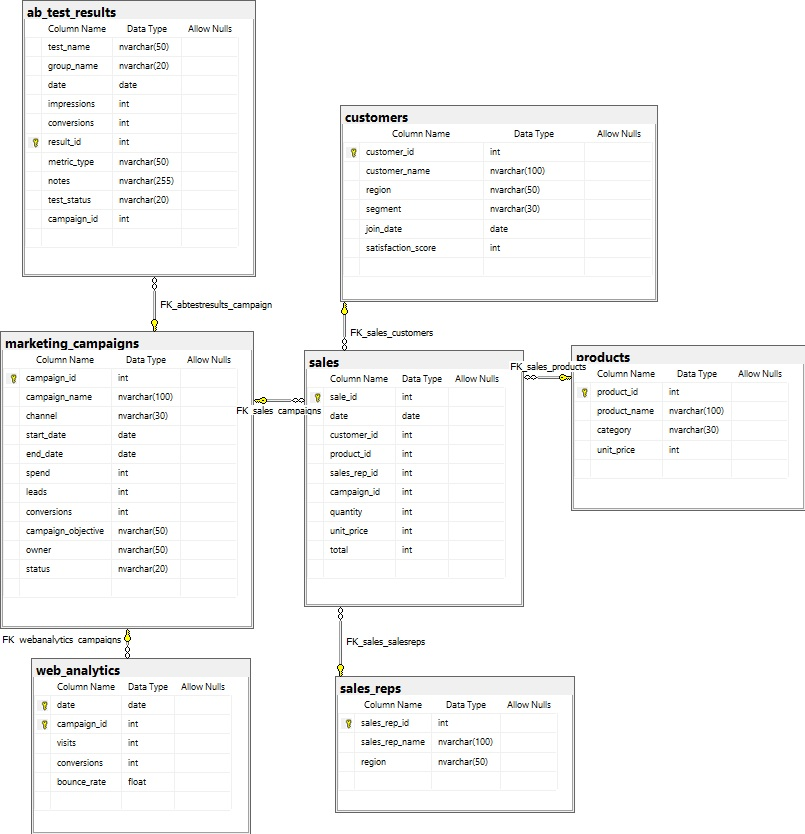

# Sales Performance Analysis

## Overview

This project delivers an end-to-end sales performance analysis solution, combining data engineering, statistical analysis, automation, and interactive visualization. It integrates SQL database design and management, Python-driven data generation, RStudio for A/B testing, Excel VBA for automation, and Tableau dashboards for dynamic insights. The goal is to empower sales and marketing teams with actionable intelligence to optimize campaigns, improve sales rep performance, and drive business growth.

---

## Table of Contents

- [Objectives](#objectives)  
- [Tools & Technologies](#tools--technologies)  
- [Business Impact](#business-impact)  
- [Database Schema & Creation](#database-schema--creation)  
- [Data Generation, Import & ETL](#data-generation-import--etl)  
- [Statistical Analysis & A/B Testing](#statistical-analysis--ab-testing)  
- [Project Structure & Key Components](#project-structure--key-components)  

---

## Objectives

- Identify sales trends and key performance drivers across products, campaigns, and sales representatives  
- Optimize marketing campaigns through detailed, filter-driven responsiveness analysis  
- Automate sales reporting and data processing to improve operational efficiency  
- Develop interactive dashboards for sales rep performance and campaign effectiveness  
- Conduct rigorous A/B testing to validate marketing strategies and improve ROI  
- Maintain a robust, scalable SQL database to support analytics and reporting  

---

## Tools & Technologies

- SQL Server: Database creation, schema design, data extraction, and transformation  
- Python: Data generation, Excel automation, and ETL scripting  
- RStudio: Statistical analysis and A/B testing of marketing campaigns  
- Tableau: Interactive dashboards for sales reps and campaign analysis  
- Excel VBA: Automation of sales reports and advanced analytics  
- Power Query: Data preparation and transformation within Excel  

---

## Business Impact

- Improved sales forecasting and pipeline visibility through integrated data views  
- Data-driven marketing campaign optimization based on multi-dimensional filter analysis  
- Enhanced sales rep performance tracking with dynamic KPIs and visualizations  
- Increased efficiency via automation of repetitive reporting and data processing tasks  
- Validated marketing strategies through rigorous A/B testing, reducing risk and improving ROI  

---

## Database Schema & Creation

- Designed a star schema with a central `sales` fact table linked to dimension tables (`customers`, `products`, `sales_reps`, `marketing_campaigns`, etc.)  
- Enforced referential integrity with primary and foreign keys  
- Created the database schema and tables using SQL scripts documented in [`scripts/Database_Creation.md`](scripts/Database_Creation.md)  
- Maintained data quality by cleaning, deduplicating, and enforcing constraints during import  

**Entity-Relationship Diagram (ERD):**

---

## Data Generation, Import & ETL

- Generated realistic mock data using Python scripts for companies, individuals, products, and campaigns  
- Imported data into SQL Server using the Import Wizard, followed by cleaning and migration to final tables  
- Documented ETL processes in [`notebooks/ETL_Processes.md`](notebooks/ETL_Processes.md) and [`notebooks/Excel_to_SQL_Import_Guide.md`](notebooks/Excel_to_SQL_Import_Guide.md)  
- Used surrogate keys and foreign keys to maintain data integrity and enable complex joins  

---

## Statistical Analysis & A/B Testing

- Conducted A/B testing on marketing campaigns using RStudio to evaluate effectiveness and optimize strategies  
- Documented statistical methods and results in [`scripts/AB_Testing_Analysis.md`](scripts/AB_Testing_Analysis.md)  
- Integrated A/B test results with campaign data in the SQL database for comprehensive analysis  

---

## Project Structure & Key Components

- **dashboards/**  
  - **Sales Representatives Performance Analysis:**  
    Interactive Tableau dashboards analyzing 10 sales reps over 13 months, featuring KPIs like total revenue, average deal size, and order counts.  
  - **Campaign Analysis:**  
    Detailed Tableau dashboards showing campaign effectiveness across multiple campaigns, with dynamic filtering by product and service to reveal responsiveness patterns.

- **data/**  
  Contains raw and processed data files, including Excel spreadsheets and data usage instructions.

- **images/**  
  Visual assets supporting documentation, including ER diagrams, Tableau screenshots, and sales analysis graphics.

- **notebooks/**  
  Markdown documentation and Python scripts for data generation, ETL workflows, and Excel automation.

- **reports/**  
  Final reports and documentation, including Excel files with VBA macros and Tableau dashboard guides.

- **scripts/**  
  Analytical scripts and documentation covering:  
  - SQL database creation and schema design  
  - VBA macros for report automation  
  - RStudio analyses for A/B testing  
  - Customer segmentation and sales rep performance analysis  
  - Campaign analysis and marketing insights  

- **README.md**  
  This comprehensive project overview and documentation entry point.

---

## Summary

This project integrates multiple technologies and methodologies to provide a robust sales performance analysis platform. By combining SQL database management, Python and RStudio analytics, Excel automation, and Tableau visualization, it delivers actionable insights and interactive tools that empower business stakeholders to make informed decisions, optimize campaigns, and improve sales effectiveness.

---

If you need help generating additional documentation, reports, or enhancing dashboards, please let me know!
