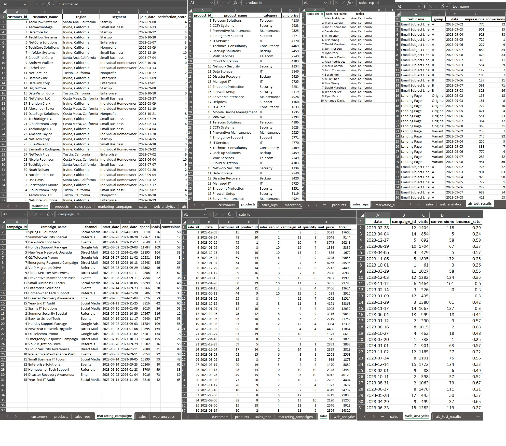

I built a Python script that generates realistic, interconnected business datasets for analytics, dashboarding, and data science practice. It creates CSVs for customers, products, sales reps, marketing campaigns, sales transactions, web analytics, and A/B test results—all with reproducible mock data.

**Features:**
- 7 business-relevant tables (customers, products, sales, etc.)
- Realistic relationships and metrics
- Reproducible results (seeded randomness)
- Great for SQL, BI, and data science demos

**👉 Don’t miss the Excel tables image below! Expand the section to view.**

**Preview:**  


<details>
<summary><strong>📊 Click to enlarge the Excel tables 📊 </strong></summary>


</details>


```Python Scripts

import pandas as pd
import numpy as np
from faker import Faker
import random

fake = Faker()
Faker.seed(42)
np.random.seed(42)
random.seed(42)

# 1. Customers
def make_customers(n=100):
    regions = ["Irvine, California", "Santa Ana, California", "Costa Mesa, California", "Tustin, California"]
    segments = ["Small Business", "Enterprise", "Startup", "Nonprofit"]
    data = []
    for i in range(1, n+1):
        data.append({
            "customer_id": i,
            "customer_name": fake.company(),
            "region": random.choices(regions, weights=[0.7,0.1,0.1,0.1])[0],
            "segment": random.choice(segments),
            "join_date": fake.date_between(start_date="-2y", end_date="-1m"),
            "satisfaction_score": random.randint(1, 10)
        })
    return pd.DataFrame(data)

# 2. Products/Services
def make_products():
    products = [
        ("Telecom Solutions", "Telecom"),
        ("CCTY Systems", "Security"),
        ("Preventive Maintenance", "Maintenance"),
        ("Emergency Support", "Support"),
        ("IT Services", "IT"),
        ("Technical Consultancy", "Consultancy"),
        ("Back-up Solutions", "Backup"),
        ("VoIP Services", "Telecom"),
        ("Cloud Migration", "IT"),
        ("Network Security", "Security"),
        ("Data Storage", "IT"),
        ("Disaster Recovery", "Backup"),
        ("Managed IT", "IT"),
        ("Endpoint Protection", "Security"),
        ("Firewall Setup", "Security"),
        ("Server Maintenance", "Maintenance"),
        ("Helpdesk", "Support"),
        ("IT Audit", "Consultancy"),
        ("Mobile Device Management", "IT"),
        ("VPN Setup", "IT")
    ]
    data = []
    for i, (name, cat) in enumerate(products, 1):
        data.append({
            "product_id": i,
            "product_name": name,
            "category": cat,
            "unit_price": random.randint(500, 5000)
        })
    return pd.DataFrame(data)

# 3. Sales Reps
def make_sales_reps(n=10):
    data = []
    for i in range(1, n+1):
        data.append({
            "sales_rep_id": i,
            "sales_rep_name": fake.name(),
            "region": "Irvine, California"
        })
    return pd.DataFrame(data)

# 4. Marketing Campaigns
def make_marketing_campaigns(n=15):
    channels = ["Email", "Social Media", "Google Ads", "Events", "Referrals", "Direct Mail"]
    data = []
    for i in range(1, n+1):
        start = fake.date_between(start_date="-1y", end_date="-2m")
        end = fake.date_between(start_date=start, end_date="today")
        data.append({
            "campaign_id": i,
            "campaign_name": f"Campaign {i}",
            "channel": random.choice(channels),
            "start_date": start,
            "end_date": end,
            "spend": random.randint(2000, 20000),
            "leads": random.randint(10, 200),
            "conversions": random.randint(5, 100)
        })
    return pd.DataFrame(data)

# 5. Sales Transactions
def make_sales(n=1200, n_customers=100, n_products=20, n_reps=10, n_campaigns=15):
    data = []
    for i in range(1, n+1):
        date = fake.date_between(start_date="2023-01-01", end_date="2024-01-31")
        cust = random.randint(1, n_customers)
        prod = random.randint(1, n_products)
        rep = random.randint(1, n_reps)
        camp = random.randint(1, n_campaigns)
        qty = random.randint(1, 10)
        unit_price = random.randint(500, 5000)
        data.append({
            "sale_id": i,
            "date": date,
            "customer_id": cust,
            "product_id": prod,
            "sales_rep_id": rep,
            "campaign_id": camp,
            "quantity": qty,
            "unit_price": unit_price,
            "total": qty * unit_price
        })
    return pd.DataFrame(data)

# 6. Web Analytics
def make_web_analytics(n=1000, n_campaigns=15):
    data = []
    for i in range(n):
        date = fake.date_between(start_date="2023-01-01", end_date="2024-01-31")
        camp = random.randint(1, n_campaigns)
        visits = random.randint(50, 2000)
        conversions = random.randint(0, visits//10)
        bounce = round(random.uniform(0.2, 0.7), 2)
        data.append({
            "date": date,
            "campaign_id": camp,
            "visits": visits,
            "conversions": conversions,
            "bounce_rate": bounce
        })
    return pd.DataFrame(data)

# 7. A/B Test Results
def make_ab_test_results():
    tests = [
        ("Email Subject Line", ["A", "B"]),
        ("Landing Page", ["Original", "Variant"])
    ]
    data = []
    for test_name, groups in tests:
        for group in groups:
            for i in range(1, 8):  # 7 days
                date = pd.Timestamp("2023-09-01") + pd.Timedelta(days=i)
                impressions = random.randint(100, 1000)
                conversions = random.randint(0, impressions//8)
                data.append({
                    "test_name": test_name,
                    "group": group,
                    "date": date,
                    "impressions": impressions,
                    "conversions": conversions
                })
    return pd.DataFrame(data)

# Generate all dataframes
dfs = {
    "customers.csv": make_customers(),
    "products.csv": make_products(),
    "sales_reps.csv": make_sales_reps(),
    "marketing_campaigns.csv": make_marketing_campaigns(),
    "sales.csv": make_sales(),
    "web_analytics.csv": make_web_analytics(),
    "ab_test_results.csv": make_ab_test_results()
}

# Save to CSV
for fname, df in dfs.items():
    df.to_csv(fname, index=False)

list(dfs.keys())

